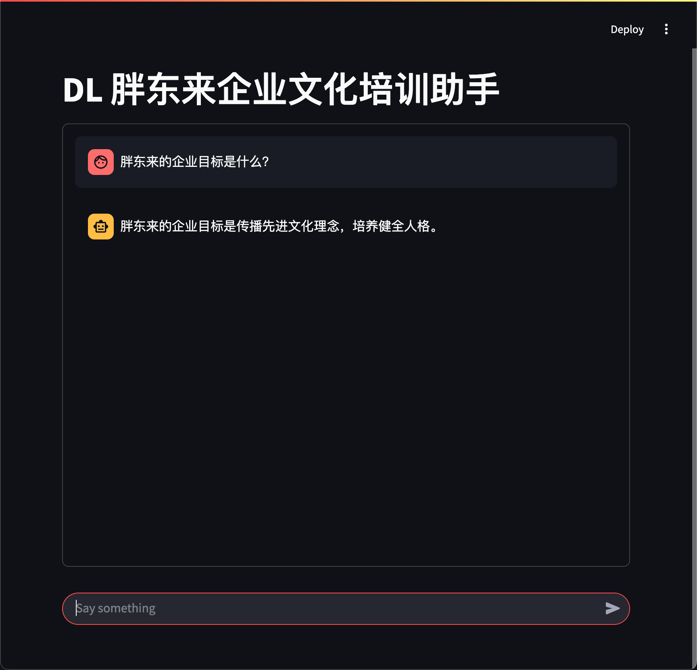
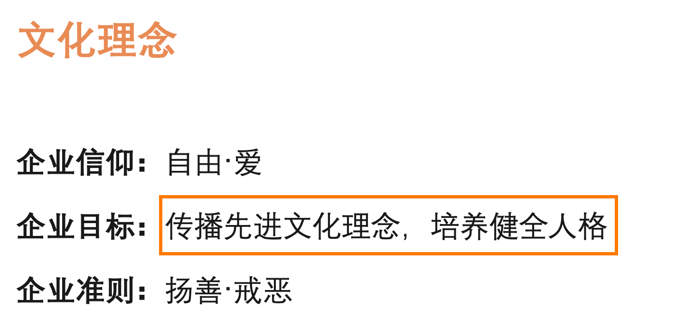

# my-rag-app

实现一个基于 RAG 的问答应用。

知识来源：[胖东来培训指导手册 - 幸福生命状态](./documents/幸福生命状态.pdf)
> 该 PDF 文件从 <https://i.azpdl.cn/pdl-index/pdf/culture/20241205_1.pdf> 下载。

## 配置

首先拷贝 `.env.example` 文件为 `.env` 文件：

```bash
cp .env.example .env
```

在 `.env` 文件中配置大模型 API 密钥。

## 初始化环境

```bash
uv sync
```

## 启动应用

1. 向量化外部知识库：

```bash
uv run embedding.py
```

2. 启动助手程序：

```bash
streamlit run main.py
```

## 运行效果

问答回复：



文档内容：



> 经简单测试，可能知识库是中文文档的缘故，使用 Gemini 嵌入模型效果不佳，使用智谱的嵌入模型效果会更好。
